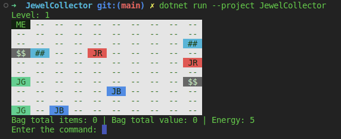
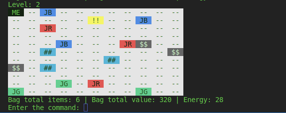
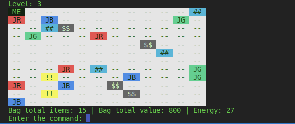
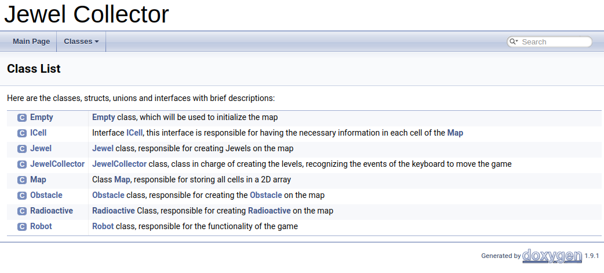
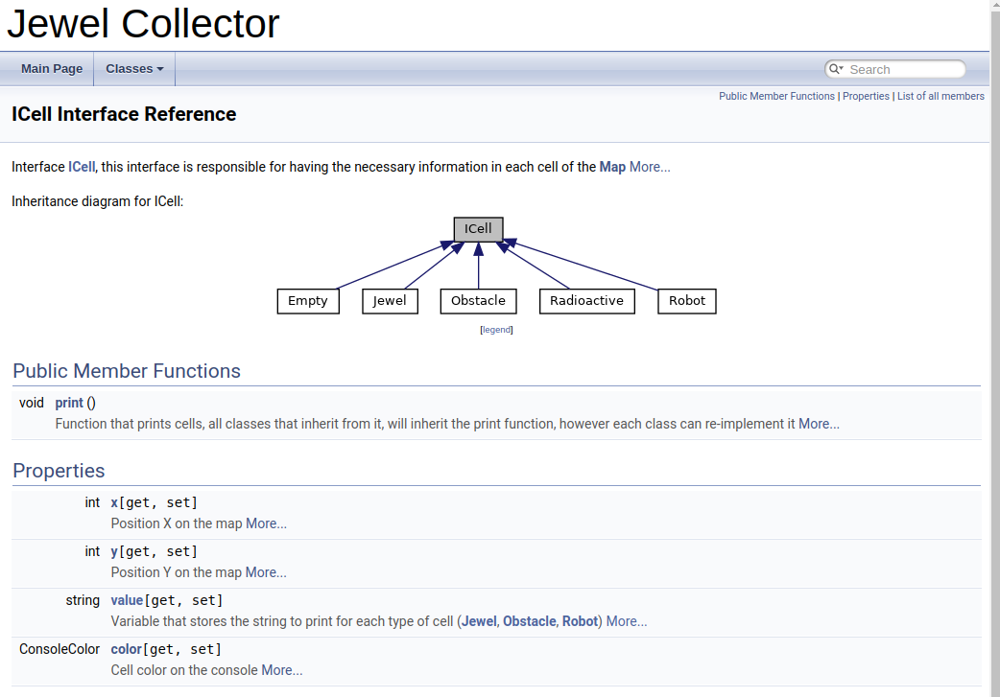

# Jewel Collector Game
This game is based on collecting jewels when we move on the map.

- Entities
  - Cell
  - Jewel
  - Obstacle
  - Radioactive

## Run
```console
$ dotnet run --project JewelCollector
```


## Software
1.  Visual Studio Code
2.  .Net 7
3.  Github

## Screenshots
- Game
  - Level 1
    - 
  - Level 2
    - 
  - Level 3
    - 

- Documentation
  - Class List
    - 
  - ICell Interface
    - 

## Contributors
- [Jesamin Melissa Zevallos Quispe](https://github.com/Jesamin-30)
- [Percy Maldonado Quispe](https://github.com/maldonadoq)